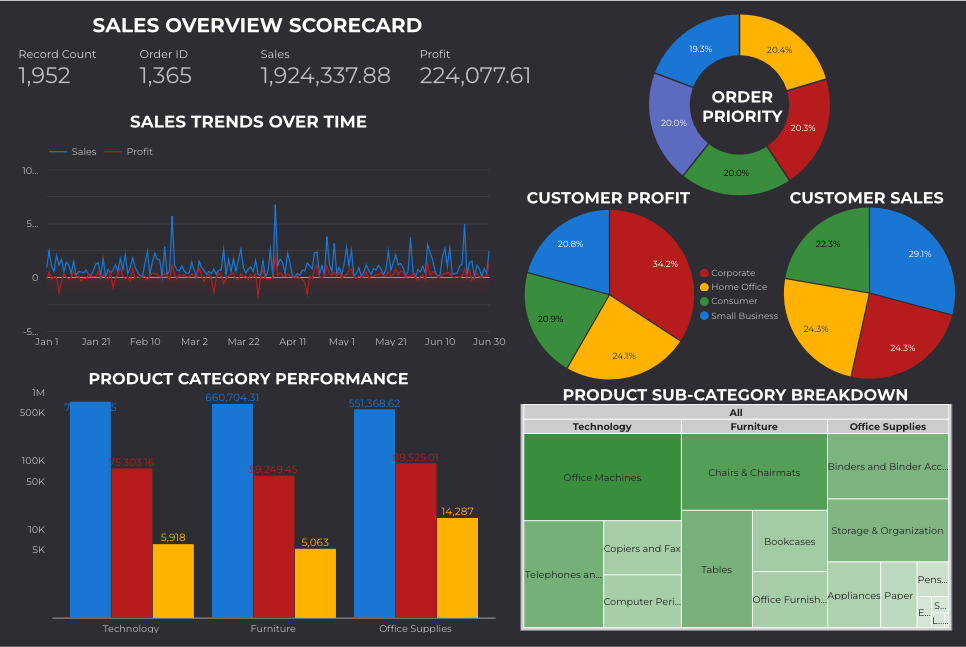

# Sales Analytics Dashboard

## Project Overview
This interactive dashboard provides comprehensive insights into sales performance across multiple dimensions. By visualizing key metrics related to product categories, customer segments, and temporal patterns, this dashboard enables data-driven decision making for optimizing sales strategies and identifying growth opportunities.

## Dashboard Access
- [View Interactive Dashboard](https://lookerstudio.google.com/s/kRYxYqLWBZ4)

## Dashboard Preview

## Key Features

### 1. Sales Overview Scorecard
- **Purpose**: Provides at-a-glance performance metrics
- **Metrics**: Total Sales, Profit, Quantity Ordered, and Order Count
- **Value**: Quickly assess overall business health and performance

### 2. Sales Trend Analysis
- **Purpose**: Track sales and profit performance over time
- **Implementation**: Time series chart with date range selector
- **Value**: Identify seasonal patterns and growth trends

### 3. Product Category Performance
- **Purpose**: Compare performance across product categories
- **Visualization**: Bar chart showing Sales, Profit, and Quantity
- **Value**: Identify top-performing and underperforming product lines

### 4. Customer Segment Analysis
- **Purpose**: Understand revenue distribution across customer segments
- **Visualization**: Pie charts for Sales and Profit by segment
- **Value**: Target marketing efforts to most valuable customer segments

### 5. Product Category Breakdown
- **Purpose**: Detailed view of product sub-categories
- **Visualization**: Treemap with hierarchical category structure
- **Value**: Identify specific product niches driving business results

### 6. Order Priority Distribution
- **Purpose**: Analyze order fulfillment by priority level
- **Visualization**: Donut chart showing distribution
- **Value**: Optimize resource allocation for order processing

### 7. Weekday Performance Analysis
- **Purpose**: Track sales patterns throughout the week
- **Visualization**: Column chart showing daily performance
- **Value**: Optimize staffing and inventory based on day-of-week patterns

### 8. Order Returns Analysis
- **Purpose**: Identify products with high return rates
- **Visualization**: Table with drill-down capability
- **Value**: Address quality issues and improve customer satisfaction

## Data Source
This dashboard utilizes a comprehensive sales dataset containing:
- **Customer Information**: ID, Name, City, Segment
- **Order Details**: Date, ID, Priority, Weekday, Returns
- **Product Information**: Category, Sub-Category, Name
- **Financial Metrics**: Sales, Profit, Quantity, Unit Price

## Implementation Details

### Data Preparation
1. Connected Google Sheets data source to Looker Studio
2. Established data type formatting (dates, currencies, numbers)
3. Created calculated fields for enhanced analysis

### Dashboard Construction
1. Designed multi-page layout with logical information hierarchy
2. Implemented cross-filtering capabilities across visualizations
3. Added interactive controls for dynamic data exploration
4. Optimized for both desktop and mobile viewing

### Key Calculations
- **Profit Margin**: `Profit / Sales`
- **Return Rate**: `Count of Returned Orders / Total Orders`
- **Day-of-Week Ordering**: Used Weekday helper field for proper sorting

## Insights

Business Insights

🏆 Performance Overview

Key Metrics Health Check: Monitor real-time performance of core metrics (Total Sales, Profit, Quantity, Order Count) to gauge overall business health.
Growth & Seasonality: Identify sales/profit trends over time (monthly/quarterly) to detect seasonal peaks, growth trajectories, or unexpected declines.
📦 Product Analysis

Top Product Categories: Compare Sales, Profit, and Quantity across categories to prioritize high-performing lines (e.g., Electronics vs. Furniture).
Sub-Category Opportunities: Drill into treemap insights to uncover niche product sub-categories driving revenue or requiring improvement.
Return Patterns: Track products with high return rates to address quality issues, update inventory strategies, or revise supplier partnerships.
👥 Customer Insights

Segment Prioritization: Analyze Sales/Profit distribution by customer segments (e.g., Corporate vs. Home Office) to refine marketing spending and loyalty programs.
Geographic Behavior: Use customer city data (from source) to tailor regional promotions or logistics planning.
⚙️ Operational Efficiency

Order Priority Allocation: Assess donut chart distribution of order priorities to optimize staffing and fulfillment workflows (e.g., focus on "Critical" orders).
Weekday Staffing & Stocking: Align staffing schedules and inventory restocking with weekday sales patterns (e.g., higher weekend demand).
🚀 Strategic Actions

High-Value Customer Targeting: Leverage segment analysis to personalize campaigns for high-profit customer groups.
Inventory Optimization: Cross-reference product performance (sales/returns) and weekday trends to reduce stockouts or overstocking.
Example Insights in Practice:

A spike in Electronics sales every November could indicate holiday demand, prompting early inventory buildup.
High returns for a specific sub-category (e.g., Office Supplies → Paper) may signal supplier quality issues.
Corporate customers contributing 60% of profit might justify dedicated account managers or bulk-order discounts.
## Future Enhancements

Plans for dashboard expansion include:

1. Adding predictive analytics for sales forecasting
2. Implementing geographic visualization of customer distribution
3. Creating customized views for different stakeholder groups
4. Incorporating inventory data for supply chain optimization

## Technical Implementation
For details on the technical implementation, see [IMPLEMENTATION.md](IMPLEMENTATION.md).

---

*This dashboard was created using Google Looker Studio.*
